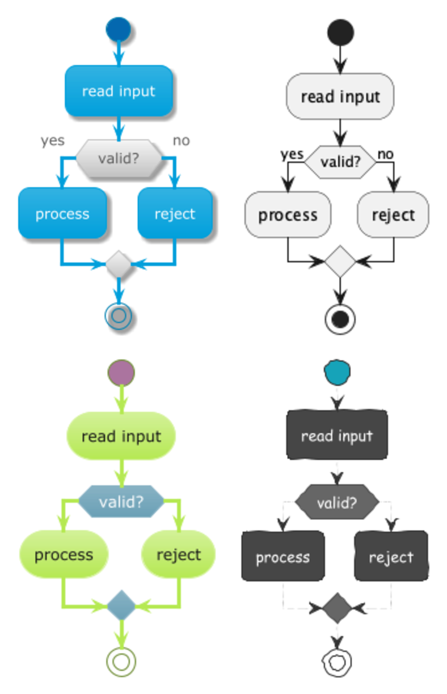

# chameleon

Render a directory of PlantUML files into visually diversified images by
sampling per-file from a probability-weighted set of named **profiles**
(theme + skinparams + handwritten mode).

`chameleon` diversifies image-to-PlantUML datasets
without modifying any `.puml` source files. Rendering controls are injected
via PlantUML's native `--theme` and `--config` mechanisms; the per-file
profile assignment is reproducible from a single seed.



*Four profiles from `examples/profiles.yaml` rendering the same activity
diagram: `default`, `whiteboard` (sketchy + handwritten), `corporate`
(bluegray + shadowing), `dark` (hacker theme).*

## Install

Python 3.11+ and a JRE are required. The repo ships with a pinned
`plantuml-1.2025.9.jar` at the root.

```bash
pip install -e '.[dev]'
```

## Quick start

Render the bundled fixture against the curated paper profiles:

```bash
chameleon run \
    --input tests/fixtures/tiny_dataset \
    --profiles examples/profiles.yaml \
    --output output/quickstart \
    --plantuml-jar plantuml-1.2025.9.jar \
    --seed 42
```

Output:

```
output/quickstart/
├── manifest.jsonl              # one JSON line per input file
├── run_config.json             # invocation metadata + realized counts
├── profiles_used.yaml          # snapshot of the input profiles YAML
└── images/
    ├── default/<rel>/<stem>.png
    ├── whiteboard/<rel>/<stem>.png
    ├── corporate/<rel>/<stem>.png
    └── dark/<rel>/<stem>.png
```

Same `--seed` + same input dir + same profiles YAML reproduces the per-file
assignment exactly. If `--seed` is omitted, one is generated and logged.

`PLANTUML_JAR` env var works as an alternative to `--plantuml-jar`.

## Profile YAML

Two top-level sections — `profiles` (definitions) and `sampling` (weights):

```yaml
profiles:
  - name: default
    theme: null
    skinparams: {}
    handwritten: false

  - name: whiteboard
    theme: sketchy
    skinparams:
      defaultFontName: "Comic Sans MS"
    handwritten: true

  - name: corporate
    theme: bluegray
    skinparams:
      shadowing: true
    handwritten: false

  - name: dark
    theme: hacker
    skinparams: {}
    handwritten: false

sampling:
  - { profile: default,    probability: 0.25 }
  - { profile: whiteboard, probability: 0.25 }
  - { profile: corporate,  probability: 0.25 }
  - { profile: dark,       probability: 0.25 }
```

- `theme` is `null` or a PlantUML theme name (no validation against
  PlantUML's actual theme list — let plantuml fail if invalid).
- `skinparams` keys/values pass through as `skinparam <key> <value>`.
- `handwritten: true` emits `!option handwritten true` in the generated
  config (PlantUML's handwritten mode is a render option, not a skinparam).
- Probabilities are normalized if they don't sum to 1.0 (with a warning).

Validate a YAML before a run:

```bash
chameleon validate examples/profiles.yaml
```

List PlantUML's built-in themes:

```bash
chameleon list-themes
```

## CLI options

```
chameleon run \
    --input <dir>              # recursive .puml search
    --profiles <yaml>          # profile + sampling YAML
    --output <dir>             # rendered images + manifest
    [--seed <int>]             # default: random, always logged
    [--format png|svg]         # default: png
    [--threads <n>]            # default: cpu count
    [--limit <n>]              # process at most N files (test runs)
    [--plantuml-jar <path>]    # alt: PLANTUML_JAR env var
    [--dry-run]                # write manifest, skip rendering
    [-v|--verbose]             # DEBUG-level logging
```

## Manifest

`manifest.jsonl`, one line per input file:

```json
{
  "input_path": "subdir/diagram_42.puml",
  "output_path": "images/whiteboard/subdir/diagram_42.png",
  "profile_name": "whiteboard",
  "render_status": "ok",
  "render_stderr": ""
}
```

`render_status` is one of `ok` / `fail` / `skip` (skip = `--dry-run`).
A single render failure does not abort the run; it's logged and the run
continues.

## Building a comparison grid

To produce a side-by-side figure like the one above, render the same input
file under each profile (one run per profile, weights set to 1.0 on the
target), then composite with ImageMagick:

```bash
magick \
  \( output/.../corporate/diagram.png \
     output/.../default/diagram.png \
     -resize 600x600 +append \) \
  \( output/.../whiteboard/diagram.png \
     output/.../dark/diagram.png \
     -resize 600x600 +append \) \
  -append \
  -background white -bordercolor white -border 10 \
  docs/grid.png
```

## Development

```bash
pytest -q             # 67 tests, ~5s
ruff check .
ruff format .

# end-to-end demo: 50 files × 4 profiles, formatted report
python scripts/run_e2e.py
```
